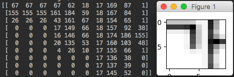
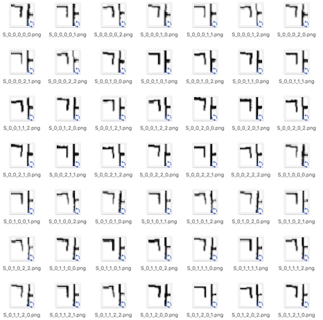

## PHD08 Conversion

> [phd08](https://www.dropbox.com/s/69cwkkqt4m1xl55/phd08.alz?dl=0) 
데이터셋을 .png 로 저장하거나, numpy array 로 바로 변환 가능한 npy 파일 형태로 변환해 줍니다. 
이미지 / 텍스트는 기존 바이너리로 되어 있던 것을 가우시안 필터로 블러링합니다.

## Requirements
- python3
- numpy
- matplotlib
- scipy

## Usage
### phd08_to_png.py
- **help**
```
python phd08_to_png.py --help
```

- **phd08** to **png**
```
python phd08_to_png.py --data_dir=DATA_DIR [--width=WIDTH] 
                       [--height=HEIGHT] [--gaussian_sigma=GAUSSIAN_SIGMA]  
```
> result in ./phd08_png_results/

### phd08_to_np_arr.py
- **help**
```
python phd08_to_np_arr.py --help
```

- **phd08** to **npy**
```
phd08_to_npy.py [-h] --data_dir DATA_DIR [--one_hot] [--width WIDTH]
                     [--height HEIGHT] [--gaussian_sigma GAUSSIAN_SIGMA]
```
> result in ./phd08_npy_results/

## Example & Screenshot
```
python phd08_to_png.py --data_dir=phd08_png_results --width=10 --height=10
```



